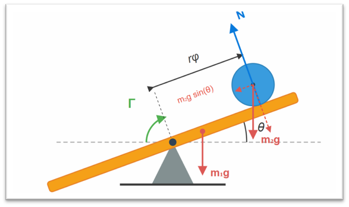
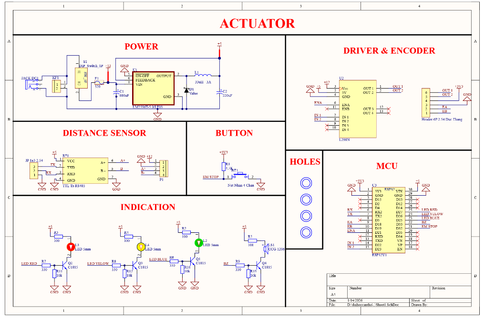
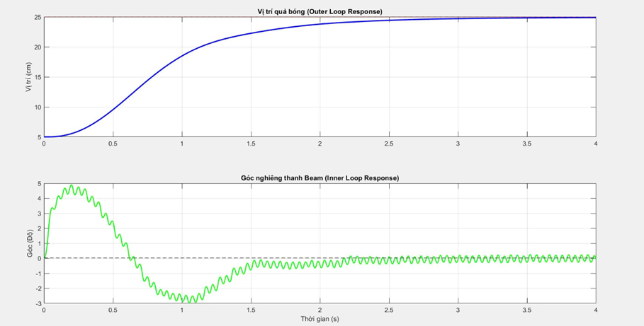
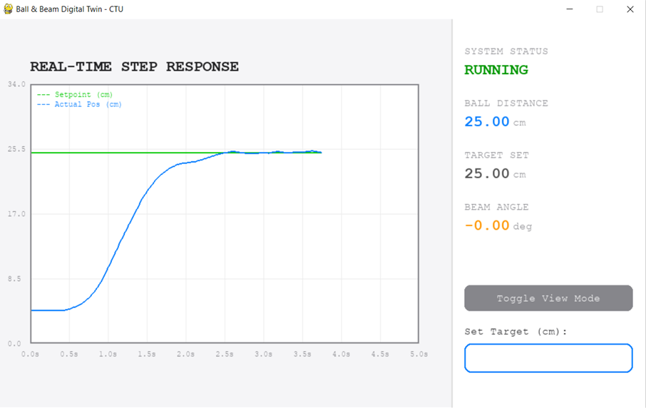

# ⚖️ BALL AND BEAM CONTROL SYSTEM

 

---

  <i><b>ABSTRACT: </b>Báo cáo trình bày quá trình mô hình hóa và thiết kế thuật toán điều khiển cho hệ thống Ball and Beam, một đối tượng cơ điện tử tiêu biểu có tính phi tuyến và thiếu dẫn động. Mục tiêu của nghiên cứu là thiết kế hệ thống phần cứng và thuật toán giúp duy trì quả bóng tại vị trí tham chiếu bất kỳ. Phương trình động lực học được xây dựng dựa trên cơ học giải tích Euler-Lagrange và xấp xỉ tuyến tính hóa quanh điểm làm việc. Để xử lý các rào cản vật lý thực tế như ma sát tĩnh, cấu trúc điều khiển phân tầng được áp dụng. Hệ thống bao gồm vòng điều khiển vị trí (20Hz) và vòng điều khiển góc (100Hz), với các hệ số được tính toán giải tích qua phương pháp gán điểm cực. Kết quả thực nghiệm trên vi điều khiển ESP32 cho thấy hệ thống đạt trạng thái ổn định, bám sát vị trí tham chiếu sau 2.5 giây. Phân tích dữ liệu thời gian thực qua giao thức UART xác nhận sự tồn tại của dao động chu kỳ giới hạn biên độ hẹp (±0.1 cm), sinh ra do đặc tính phi tuyến cơ khí và độ trễ lấy mẫu của cảm biến.</i>

---

## 1\. SYSTEM OVERVIEW

Hệ thống **Ball and Beam** là một đối tượng cơ điện tử đặc trưng mang tính phi tuyến (non-linear) và thiếu dẫn động (under-actuated). Báo cáo trình bày quá trình mô hình hóa động lực học, thiết kế phần cứng và triển khai thuật toán điều khiển phân tầng (**Cascade Control**) trên vi điều khiển ESP32. Mục tiêu cốt lõi là điều khiển vị trí quả bóng hội tụ về **Setpoint** với sai số thấp nhất, bất chấp các ràng buộc vật lý như ma sát tĩnh (static friction) và vùng chết (deadband) của cơ cấu chấp hành.

## 2\. KÝ HIỆU & ĐƠN VỊ VẬT LÝ

Bảng tóm tắt các đại lượng động lực học và điện - cơ sử dụng trong quá trình mô hình hóa.

| Ký hiệu | Ý nghĩa | Đơn vị |
| :--- | :--- | :--- |
| $x, \dot{x}, \ddot{x}$ | Vị trí, vận tốc, gia tốc tịnh tiến của quả bóng | cm, cm/s, cm/s² |
| $x_{ref}$ | Vị trí tham chiếu (Setpoint) | cm |
| $e_x$ | Sai số vị trí vòng ngoài | cm |
| $\theta, \dot{\theta}, \ddot{\theta}$ | Góc nghiêng, vận tốc góc, gia tốc góc của thanh | rad, rad/s, rad/s² |
| $\theta_{ref}$ | Góc nghiêng tham chiếu vòng trong | rad |
| $r$ | Bán kính quả bóng | cm |
| $m, m_{eff}$ | Khối lượng thực và khối lượng biểu kiến của quả bóng | kg |
| $g$ | Gia tốc trọng trường | m/s² |
| $V, i, R$ | Điện áp, dòng điện phần ứng, điện trở động cơ DC | V, A, $\Omega$ |
| $K_t, K_e$ | Hằng số mô-men, Hằng số sức điện động ngược | N·m/A, V·s/rad |
| $a_{req}$ | Gia tốc yêu cầu tính toán từ luật điều khiển PD | cm/s² |

## 3\. HARDWARE ARCHITECTURE

Hệ thống được thiết kế tối ưu hóa nguồn và cách ly nhiễu (isolation) giữa dòng logic và dòng công suất.

[**Image: Chèn ảnh Mô hình vật lý hoàn thiện tại đây**]

  * **Power Supply**: Nguồn tổng **12V DC** cấp trực tiếp cho module công suất động cơ. Sử dụng IC xung LM2596T hạ áp xuống **5V/3.3V** cấp cho MCU và hệ thống cảm biến.
  * **Controller**: Vi điều khiển **ESP32** (Dual-core, tích hợp phần cứng xử lý ngắt tốc độ cao).
  * **Actuator**: Động cơ DC giảm tốc (**12V - 65 RPM**) qua mạch cầu H **L298N**.
  * **Sensors**:
      * **Vị trí ($x$)**: Cảm biến Laser SEN0492 công nghiệp, giao tiếp qua RS485 (chuyển đổi qua MAX485 sang UART).
      * **Góc ($\theta$)**: Incremental Encoder phản hồi tín hiệu pha A/B về ngắt ngoài của ESP32.

## 4\. MATHEMATICAL MODELING

Sử dụng phương pháp cơ học giải tích **Euler-Lagrange** dựa trên tổng động năng (tịnh tiến + quay) và thế năng của hệ thống.

Phương trình động lực học phi tuyến hoàn chỉnh được thiết lập qua hàm Lagrange $L = K - \Pi$:
$$\ddot{x} = \frac{m}{m_{eff}} x \dot{\theta}^2 - \frac{mg}{m_{eff}} \sin\theta$$

Tại trạng thái xác lập, hệ thống hoạt động quanh điểm làm việc $\theta \approx 0$ và $\dot{\theta} \approx 0$. Bỏ qua lực ly tâm ($x\dot{\theta}^2 \approx 0$) và xấp xỉ $\sin\theta \approx \theta$, mô hình được **tuyến tính hóa** (linearization) thành dạng tích phân kép lý tưởng:
$$\ddot{x} = -\frac{3g}{5}\theta$$
*(Với đại lượng $m_{eff} = \frac{5}{3}m$ là khối lượng biểu kiến của quả bóng).*
Hàm truyền hệ hở: $G(s) = \frac{X(s)}{\Theta(s)} = \frac{-3g}{5s^2}$.

## 5\. CASCADE CONTROL STRATEGY & PID TUNING

Để giải quyết bài toán thiếu dẫn động và xử lý ma sát tĩnh của động cơ, kiến trúc **Cascade Control** được áp dụng với 2 vòng lặp độc lập. Toàn bộ thông số được tính toán giải tích qua phương pháp **Gán điểm cực (Pole Placement)**.

### 5.1. Vòng ngoài (Position Control - 20Hz)

Điều khiển động lực học quả bóng. Sử dụng luật **PD** tạo ra tín hiệu gia tốc yêu cầu ($a_{req}$) từ sai số vị trí $e_x = x_{ref} - x$.

  * Luật điều khiển PD: $a_{req} = K_p e_x + K_d \dot{e}_x$. (Khâu I bị triệt tiêu do đối tượng $\frac{1}{s^2}$ đã có đặc tính tích phân kép).
  * Phương trình đặc trưng hệ kín: $s^2 + K_d s + K_p = 0$.
  * Đối chiếu hệ bậc 2 chuẩn $s^2 + 2\zeta\omega_n s + \omega_n^2 = 0$.
  * **Cấu hình mong muốn:** Không vọt lố ($\zeta = 1$), thời gian xác lập $T_s = 2$ giây $\implies \omega_n = \frac{4}{\zeta T_s} = 2$ rad/s.
  * **Kết quả thông số PD:**
    $$K_p = \omega_n^2 = 4.0$$
    $$K_d = 2\zeta\omega_n = 4.0$$
  * **Tuyến tính hóa hồi tiếp:** Góc tham chiếu truyền xuống vòng trong để khử phi tuyến trọng lực:
    $$\theta_{ref} = \arcsin\left(\frac{-a_{req}}{3g/5}\right)$$

### 5.2. Vòng trong (Angle Control - 100Hz)

Điều khiển bám quỹ đạo góc cho động cơ DC L298N.

  * **Nhận dạng hệ thống:** Từ đáp ứng bước thực nghiệm ở 100% PWM (**12V**).
    [**Image: Chèn ảnh Biểu đồ đáp ứng bước vận tốc góc của động cơ DC tại đây**]
    Vận tốc xác lập $\omega_{ss} \approx 6.8$ rad/s, hằng số thời gian $\tau \approx 0.2$ s.
    Hàm truyền động cơ vòng hở: $G_m(s) = \frac{2.83}{s(s+5)}$.
  * **Thiết kế PID:** Áp dụng luật PID $C(s) = \frac{K_{d\theta}s^2 + K_{p\theta}s + K_{i\theta}}{s}$. Phương trình đặc trưng bậc 3:
    $$s^3 + (5 + 2.83K_{d\theta})s^2 + 2.83K_{p\theta}s + 2.83K_{i\theta} = 0$$
  * **Cấu hình mong muốn:** Phải đáp ứng nhanh hơn vòng ngoài $\implies \omega_{n\theta} = 3.8$ rad/s, $\zeta = 1.1$ (quá cản nhẹ để tránh rung rớt bóng), điểm cực thực $p_0 = 0.02$. Phương trình chuẩn hệ bậc 3:
    $$(s + p_0)(s^2 + 2\zeta\omega_{n\theta}s + \omega_{n\theta}^2) = 0$$
  * **Kết quả thông số PID vòng trong (Cân bằng hệ số):**
    $$K_{p\theta} = 5.16, \quad K_{i\theta} = 0.10, \quad K_{d\theta} = 1.19$$

## 6\. FIRMWARE & RTOS IMPLEMENTATION

Hệ thống sử dụng **FreeRTOS** để đảm bảo tính thời gian thực (Real-time Determinism).

  * **Core 1 (Data Acquisition Task):** Quản lý giao thức Modbus RTU đọc cảm biến Laser (20Hz).
  * **Core 0 (Control Task):** Độ ưu tiên cao nhất (Highest Priority, 100Hz). Tính toán Cascade PID, xuất tín hiệu PWM. Triển khai **Failsafe**: tự động ngắt động cơ (Stop state) khi góc thanh beam vượt quá $\pm 20^\circ$.

## 7\. RESULTS & DISCUSSION

Chất lượng bộ điều khiển được kiểm chứng qua phép thử bước (Step Response) với quỹ đạo tham chiếu dịch chuyển từ **5 cm** lên **25 cm**. Toàn bộ dữ liệu được log trực tiếp về giao diện Digital Twin (Python) qua UART với baudrate **115200 bps**.

**Bảng so sánh đáp ứng Thực tế và Mô phỏng toán học**
| Tiêu chí | Mô phỏng | Thực nghiệm |
| :--- | :--- | :--- |
| **Thời gian trễ** | $\approx 0$ s | $\approx 0.5$ s |
| **Thời gian xác lập ($T_s$)** | $\approx 2.5$ s | $\approx 2.5$ s |
| **Độ vọt lố (Overshoot)** | 0% | 0% |
| **Đặc tính xác lập** | Tuyệt đối phẳng | Dao động (Limit Cycle $\pm 0.1$ cm) |

**Phân tích kỹ thuật:**

  * Mặc dù bám sát đúng $T_s$ và triệt tiêu hoàn toàn vọt lố nhờ trạng thái *Critically Damped*, quỹ đạo thực tế bộc lộ độ trễ khởi động $\approx 0.5$ giây. Điều này sinh ra do **vùng chết ma sát tĩnh** (Static friction deadband) của động cơ 65 RPM. Hệ thống cần tích lũy sai số đủ lớn để xuất lượng PWM thắng sức ỳ cơ khí.
  * Ở trạng thái xác lập, hệ thống tồn tại **dao động chu kỳ giới hạn (Limit Cycle)** biên độ $\pm 0.1$ cm. Đây là đặc tính vật lý tất yếu của cơ cấu chấp hành có bánh răng giảm tốc và hiện tượng rơi áp (Voltage Drop) 1.5V-2.0V trên BJT của IC công suất L298N.

## 8\. CONCLUSION & REFERENCES

**Những điều đã làm được:**

  * Triển khai hoàn thiện Digital Twin và giám sát RTOS trực tiếp, duy trì sampling rate khắt khe.
  * Thuật toán thể hiện tính Robustness cao, giữ nguyên thông số gán điểm cực lý thuyết nạp xuống MCU hoạt động chính xác mà không cần dò thông số thủ công (Trial & Error).
  * Giải quyết triệt để vấn đề Overshoot gây nhiễu đạo hàm (Derivative Kick).

**Tài liệu tham khảo:**

1.  Y. Aoustin and A. Formal’skii, *"Ball on a beam: stabilization under saturated input control..."*
2.  K. Ogata, *"Modern Control Engineering"*, 5th ed.
3.  STMicroelectronics, *"L298 Dual Full-Bridge Driver Datasheet"*.